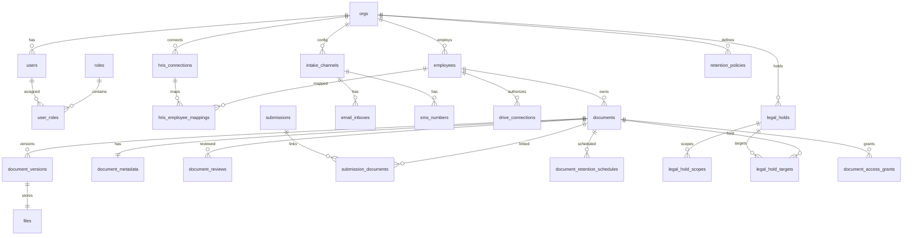

* **/table** = relational entities + constraints
* **/vector** = embeddings for semantic search/classification
* **/events** = immutable audit + workflow event stream
* **/memory** = derived “state summaries” + agent/workflow memory (optional but powerful)

---

## Data Model Principles

1. **Tenant isolation everywhere**

   * Every row that belongs to a customer includes `org_id`.
2. **Documents are immutable by default**

   * Store files + versions; changes create new versions.
3. **HRIS is bi-directional**

   * Store mappings + sync cursors + conflict logs.
4. **Legal holds override retention**

   * Retention scheduling is computed but can be suspended.
5. **Audit = append-only events**

   * Everything important is an event in `/events`.

---

## `/table` Schema (ZeroDB Tables)

### 1) Organizations & Identity

#### `orgs`

* `id` (pk, uuid)
* `name` (text)
* `slug` (text, unique)
* `plan_tier` (enum: `starter|growth|enterprise`)
* `status` (enum: `active|suspended|deleted`)
* `created_at` (timestamptz)
* `updated_at` (timestamptz)

Indexes:

* unique(`slug`)

#### `users`

* `id` (pk, uuid)
* `org_id` (fk -> orgs.id)
* `email` (text)
* `phone_e164` (text, nullable)
* `full_name` (text)
* `status` (enum: `active|invited|disabled`)
* `created_at`, `updated_at`

Indexes:

* (`org_id`, `email`) unique

#### `roles`

* `id` (pk, uuid)
* `org_id` (fk)
* `name` (enum: `hr_admin|hr_manager|legal|it_admin|auditor|employee`)
* `created_at`

Indexes:

* (`org_id`, `name`) unique

#### `user_roles`

* `id` (pk, uuid)
* `org_id` (fk)
* `user_id` (fk -> users.id)
* `role_id` (fk -> roles.id)
* `created_at`

Indexes:

* (`org_id`, `user_id`)
* (`org_id`, `role_id`)

---

### 2) Employees (HRIS-linked)

#### `employees`

* `id` (pk, uuid)
* `org_id` (fk)
* `user_id` (fk -> users.id, nullable) *(employee portal link)*
* `external_employee_key` (text, nullable) *(internal stable key, not HRIS-specific)*
* `first_name`, `last_name` (text)
* `email` (text, nullable)
* `phone_e164` (text, nullable)
* `work_location_state` (char(2)) *(for retention defaults)*
* `employment_status` (enum: `active|loa|terminated|rehired`)
* `hire_date` (date, nullable)
* `termination_date` (date, nullable)
* `department` (text, nullable)
* `job_title` (text, nullable)
* `created_at`, `updated_at`

Indexes:

* (`org_id`, `email`)
* (`org_id`, `employment_status`)
* (`org_id`, `work_location_state`)

---

### 3) HRIS Integrations (ADP, Gusto, Workday) – Bi-Directional

#### `hris_connections`

* `id` (pk, uuid)
* `org_id` (fk)
* `provider` (enum: `adp|gusto|workday`)
* `status` (enum: `active|paused|error|revoked`)
* `oauth_ref` (text, nullable) *(pointer to encrypted secret storage if needed)*
* `sync_mode` (enum: `bidirectional`)
* `last_sync_at` (timestamptz, nullable)
* `sync_cursor` (text, nullable)
* `created_at`, `updated_at`

Indexes:

* (`org_id`, `provider`) unique

#### `hris_employee_mappings`

* `id` (pk, uuid)
* `org_id` (fk)
* `hris_connection_id` (fk)
* `employee_id` (fk -> employees.id)
* `hris_employee_id` (text) *(provider-specific identifier)*
* `hris_profile_hash` (text, nullable) *(for change detection)*
* `last_pulled_at` (timestamptz, nullable)
* `last_pushed_at` (timestamptz, nullable)
* `created_at`, `updated_at`

Indexes:

* (`org_id`, `hris_connection_id`, `hris_employee_id`) unique
* (`org_id`, `employee_id`)

#### `hris_sync_jobs`

* `id` (pk, uuid)
* `org_id` (fk)
* `hris_connection_id` (fk)
* `direction` (enum: `pull|push`)
* `status` (enum: `queued|running|success|failed`)
* `started_at`, `finished_at` (timestamptz, nullable)
* `error_message` (text, nullable)
* `stats_json` (jsonb, nullable)
* `created_at`

Indexes:

* (`org_id`, `hris_connection_id`, `created_at` desc)

#### `hris_conflicts`

* `id` (pk, uuid)
* `org_id` (fk)
* `hris_connection_id` (fk)
* `entity_type` (enum: `employee|document|compliance_status`)
* `entity_id` (uuid)
* `conflict_type` (enum: `field_mismatch|stale_write|missing_mapping`)
* `resolution` (enum: `pending|resolved_hris_wins|resolved_docflow_wins|manual`)
* `details_json` (jsonb)
* `created_at`, `resolved_at` (timestamptz, nullable)

Indexes:

* (`org_id`, `resolution`)
* (`org_id`, `created_at` desc)

---

### 4) Intake Channels (Upload, Email, SMS, Drives)

#### `intake_channels`

* `id` (pk, uuid)
* `org_id` (fk)
* `type` (enum: `web_upload|email|sms|drive`)
* `status` (enum: `enabled|disabled`)
* `config_json` (jsonb) *(limits, allowed types, etc.)*
* `created_at`, `updated_at`

Indexes:

* (`org_id`, `type`) unique

#### `email_inboxes`

* `id` (pk, uuid)
* `org_id` (fk)
* `intake_channel_id` (fk)
* `inbox_address` (text, unique) *(e.g., [org+token@inbound.docflowhr.com](mailto:org+token@inbound.docflowhr.com))*
* `routing_mode` (enum: `sender_map|token_map|both`)
* `created_at`

#### `sms_numbers`

* `id` (pk, uuid)
* `org_id` (fk)
* `intake_channel_id` (fk)
* `provider` (enum: `twilio`)
* `phone_e164` (text, unique)
* `twilio_sid` (text)
* `created_at`

#### `drive_connections`

* `id` (pk, uuid)
* `org_id` (fk)
* `employee_id` (fk -> employees.id, nullable) *(employee-authorized import)*
* `provider` (enum: `dropbox|box|google_drive|onedrive`)
* `status` (enum: `active|revoked|expired`)
* `oauth_ref` (text) *(pointer to secret storage)*
* `scope` (enum: `file_picker_only`)
* `created_at`, `updated_at`

Indexes:

* (`org_id`, `provider`)
* (`org_id`, `employee_id`, `provider`)

---

### 5) Documents, Files, Versions, Classification

#### `documents`

* `id` (pk, uuid)
* `org_id` (fk)
* `employee_id` (fk -> employees.id)
* `category_id` (fk -> document_categories.id, nullable)
* `status` (enum: `received|needs_review|approved|rejected|expired`)
* `source` (enum: `web_upload|email|sms|drive`)
* `current_version_id` (fk -> document_versions.id, nullable)
* `received_at` (timestamptz)
* `created_at`, `updated_at`

Indexes:

* (`org_id`, `employee_id`, `received_at` desc)
* (`org_id`, `status`)

#### `document_versions`

* `id` (pk, uuid)
* `org_id` (fk)
* `document_id` (fk -> documents.id)
* `version_number` (int)
* `file_id` (fk -> files.id)
* `checksum_sha256` (text)
* `mime_type` (text)
* `page_count` (int, nullable)
* `extracted_text_ref` (text, nullable) *(optional: object ref to extracted text)*
* `created_by_user_id` (fk -> users.id, nullable)
* `created_at`

Indexes:

* (`org_id`, `document_id`, `version_number`) unique

#### `files`

* `id` (pk, uuid)
* `org_id` (fk)
* `storage_provider` (enum: `zerodb_object`)
* `object_key` (text) *(path in ZeroDB object storage)*
* `size_bytes` (bigint)
* `encrypted` (bool)
* `malware_scan_status` (enum: `pending|clean|infected|failed`)
* `created_at`

Indexes:

* (`org_id`, `created_at` desc)

#### `document_categories`

* `id` (pk, uuid)
* `org_id` (fk)
* `name` (text) *(I-9, W-4, Offer Letter, etc.)*
* `is_system` (bool)
* `retention_policy_id` (fk -> retention_policies.id, nullable)
* `created_at`

Indexes:

* (`org_id`, `name`) unique

#### `document_metadata`

* `id` (pk, uuid)
* `org_id` (fk)
* `document_id` (fk)
* `issue_date` (date, nullable)
* `expiration_date` (date, nullable)
* `issuer` (text, nullable)
* `fields_json` (jsonb) *(extracted structured fields)*
* `created_at`, `updated_at`

Indexes:

* (`org_id`, `document_id`) unique

#### `document_reviews`

* `id` (pk, uuid)
* `org_id` (fk)
* `document_id` (fk)
* `review_status` (enum: `needs_review|approved|rejected`)
* `reviewed_by_user_id` (fk -> users.id)
* `review_notes` (text, nullable)
* `reviewed_at` (timestamptz)
* `created_at`

Indexes:

* (`org_id`, `document_id`, `reviewed_at` desc)

---

### 6) Submission Receipts (proof + mapping)

#### `submissions`

* `id` (pk, uuid)
* `org_id` (fk)
* `employee_id` (fk)
* `channel` (enum: `web_upload|email|sms|drive`)
* `channel_ref_id` (uuid, nullable) *(email_inbox_id, sms_number_id, drive_connection_id)*
* `sender_identifier` (text, nullable) *(email sender / sms sender)*
* `received_at` (timestamptz)
* `status` (enum: `received|processed|failed`)
* `error_message` (text, nullable)
* `created_at`

Indexes:

* (`org_id`, `employee_id`, `received_at` desc)
* (`org_id`, `status`)

#### `submission_documents`

* `id` (pk, uuid)
* `org_id` (fk)
* `submission_id` (fk -> submissions.id)
* `document_id` (fk -> documents.id)
* `created_at`

Indexes:

* (`org_id`, `submission_id`)
* (`org_id`, `document_id`)

---

### 7) Retention Engine (State Defaults + Overrides)

#### `retention_policies`

* `id` (pk, uuid)
* `org_id` (fk, nullable) *(null = system default template)*
* `scope` (enum: `system|org|category`)
* `name` (text)
* `duration_years` (int)
* `start_event` (enum: `received|termination`)
* `created_at`, `updated_at`

Indexes:

* (`org_id`, `scope`)

#### `state_retention_defaults`

* `id` (pk, uuid)
* `state_code` (char(2))
* `policy_type` (enum: `general_employment_record`)
* `retention_policy_id` (fk -> retention_policies.id)
* `effective_date` (date)
* `created_at`

Indexes:

* (`state_code`, `policy_type`, `effective_date` desc)

#### `document_retention_schedules`

* `id` (pk, uuid)
* `org_id` (fk)
* `document_id` (fk)
* `retention_policy_id` (fk)
* `retention_start_at` (timestamptz)
* `delete_eligible_at` (timestamptz)
* `status` (enum: `scheduled|paused_legal_hold|deleted|canceled`)
* `created_at`, `updated_at`

Indexes:

* (`org_id`, `status`)
* (`org_id`, `delete_eligible_at`)

---

### 8) Legal Hold Workflows

#### `legal_holds`

* `id` (pk, uuid)
* `org_id` (fk)
* `status` (enum: `active|released`)
* `title` (text)
* `reason` (text, nullable)
* `created_by_user_id` (fk -> users.id)
* `created_at`
* `released_at` (timestamptz, nullable)
* `released_by_user_id` (fk -> users.id, nullable)

Indexes:

* (`org_id`, `status`)
* (`org_id`, `created_at` desc)

#### `legal_hold_scopes`

* `id` (pk, uuid)
* `org_id` (fk)
* `legal_hold_id` (fk -> legal_holds.id)
* `scope_type` (enum: `employee|department|category|date_range|all_org`)
* `employee_id` (fk -> employees.id, nullable)
* `department` (text, nullable)
* `category_id` (fk -> document_categories.id, nullable)
* `start_date` (date, nullable)
* `end_date` (date, nullable)
* `created_at`

Indexes:

* (`org_id`, `legal_hold_id`)
* (`org_id`, `scope_type`)

#### `legal_hold_targets`

*(materialized targeting for fast enforcement; computed at hold-time and updated on new docs)*

* `id` (pk, uuid)
* `org_id` (fk)
* `legal_hold_id` (fk)
* `document_id` (fk -> documents.id)
* `created_at`

Indexes:

* (`org_id`, `legal_hold_id`)
* (`org_id`, `document_id`) unique

---

### 9) Notifications (Email/SMS)

#### `notifications`

* `id` (pk, uuid)
* `org_id` (fk)
* `employee_id` (fk, nullable)
* `user_id` (fk -> users.id, nullable)
* `channel` (enum: `email|sms`)
* `provider` (enum: `twilio|smtp|sendgrid|resend`)
* `template_key` (text)
* `payload_json` (jsonb)
* `status` (enum: `queued|sent|failed`)
* `provider_message_id` (text, nullable)
* `created_at`, `updated_at`

Indexes:

* (`org_id`, `status`)
* (`org_id`, `created_at` desc)

---

### 10) Access Control for Documents (granular sharing)

#### `document_access_grants`

* `id` (pk, uuid)
* `org_id` (fk)
* `document_id` (fk)
* `principal_type` (enum: `user|role`)
* `principal_id` (uuid) *(user_id or role_id)*
* `permission` (enum: `view|download|review|admin`)
* `created_at`

Indexes:

* (`org_id`, `document_id`)
* (`org_id`, `principal_type`, `principal_id`)

---

## `/vector` Schema (ZeroDB Vectors)

### `document_chunks`

Use for semantic search, classification, and retrieval.

* `id` (uuid)
* `org_id` (uuid)
* `document_id` (uuid)
* `version_id` (uuid)
* `chunk_index` (int)
* `text` (text)
* `embedding` (vector) *(ZeroDB vector field)*
* `metadata_json` (jsonb) *(category guess, confidence, etc.)*
* `created_at` (timestamptz)

Recommended indexes:

* Vector index on `embedding`
* Filter indexes: (`org_id`, `document_id`), (`org_id`, `created_at`)

### Optional: `policy_knowledge_chunks`

If you want an “AI compliance assistant”:

* `id`, `org_id` (nullable for global), `state_code`, `text`, `embedding`, `metadata_json`, `created_at`

---

## `/events` Schema (Immutable Audit + Workflow Stream)

### `event_stream`

Each event is append-only and queryable.

Core fields:

* `id` (uuid)
* `org_id`
* `actor_type` (enum: `user|employee|system|hris`)
* `actor_id` (uuid/text)
* `event_type` (text)
  Examples:

  * `document.received`
  * `document.classified`
  * `document.review.approved`
  * `retention.scheduled`
  * `legal_hold.applied`
  * `hris.push.success`
* `entity_type` (enum: `employee|document|submission|legal_hold|hris_connection`)
* `entity_id` (uuid)
* `payload_json` (jsonb)
* `created_at` (timestamptz)

**This replaces “audit tables”** and gives you a clean compliance story.

---

## `/memory` Schema (Derived State + Agent Memory)

### `employee_compliance_state`

Derived “current truth” that’s fast to query.

* `id` (uuid)
* `org_id`
* `employee_id`
* `state_json` (jsonb)

  * required docs completeness
  * missing docs list
  * expirations soon
  * holds applied
* `computed_at`

### `org_config_memory`

* `org_id`
* `state_json` (jsonb)

  * enabled channels
  * retention overrides
  * HRIS mapping rules
* `updated_at`

---

## Mermaid ERD (High-Level)

---

## Suggested “System Defaults” to Seed (Important for Florida launch)

Seed these tables at deploy-time:

* `document_categories` (system set: I-9, W-4, Offer Letter, ID, Benefits, Performance, Other)
* `retention_policies` (system templates)
* `state_retention_defaults` (FL + TX + AZ + NC + TN baseline)
* `roles` (hr_admin/hr_manager/legal/it_admin/auditor/employee)

---

## Implementation Notes (ZeroDB-native)

* **Object storage:** store raw files in ZeroDB object layer (`files.object_key`)
* **Vectorization:** run chunking + embeddings async; store in `/vector document_chunks`
* **Audit:** every mutation emits an `/events` record
* **Legal hold enforcement:** check active `legal_hold_targets` before:

  * deletion
  * retention job execution
  * “remove version” attempts (should be disallowed anyway)

---

